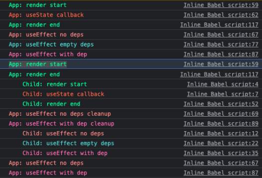
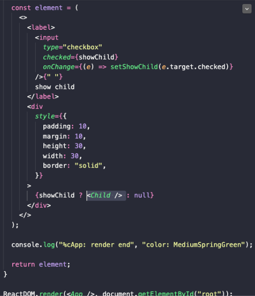
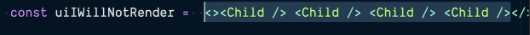
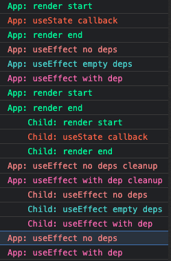
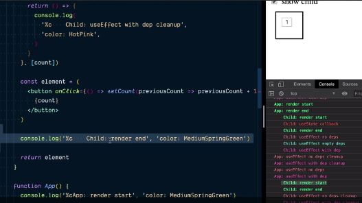
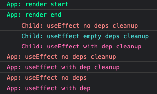
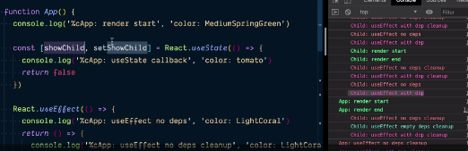

# Entendiendo el React Hook Flow

Aveces podría ser útil tu código va estar corriendo cuando use reactHooks cuando haces una pequeña app que chekiada para mostrar un Child y dentro de esta caja puede hacer un Render cuando esto, el checkbox es cheked luego cuando tu das click dentro de este button va a incrementar el contador

El camino es que creamos un Child componente manteniendo un countState y luego que tienes todo un grupo de useEffect aquí tenemos un simple login aquí cuando el callback es llamado muestra la consola provee y limpia, luego creamos un react element para el render de la pagina, luego tenemos un log ante de finalizar y retornamos el elemento de react creado.
Tenemos nuestra function componente de App excepto aquí donde tenemos nuestro
useState mantenemos showChild boolean state y con useEffect tenemos un Render de elementos de react aquí para hacer Render de la UI.

1- La primera cosa que podemos ver en esta App
-> es el App: Render Start

lo primero que pasa es que react llama a:

```jsx
ReactDOM.render(<App />, document.getElementById("root"));
```

A nuestra App -> llama a nuestro function componente

2- La siguiente cosa que pasa llama a react useState inmediatamente react va llamar a la function, recupera el initialState para mostrar el child state donde el callback es llamado

console.log("%cApp: render start", "color: MediumSpringGreen");

```jsx
const [showChild, setShowChild] = React.useState(() => {
  console.log("%cApp: useState callback", "color: tomato");
  return false;
});
```

3- Luego llamamos a todo los react useEffect avisa que los log aparecen en nuestra consola. Instancia y actualmente crear este elemento

```jsx
 const element = (
          <>
            <label>
              <input
                type="checkbox"
                checked={showChild}
                onChange={(e) => setShowChild(e.target.checked)}
              />{" "}
              show child
            </label>
            <div
              style={{
                padding: 10,
                margin: 10,
                height: 30,
                width: 30,
                border: "solid",
              }}
            >
              {showChild ? <Child /> : null}
            </div>
          </>
        );

        console.log("%cApp: render end", "color: MediumSpringGreen");

        return element;
      }
```

Y obtiene el log para el console de la App cuando el Render termina

Una cosa que pasa es que react actualiza el DOM luego asincronicamente tarde esto va llamar a useEffect callbacks dentro de un tiempo de manera ordenada

No necesitamos limpiar por que no es necesario acá

```jsx
 function App() {
        console.log("%cApp: render start", "color: MediumSpringGreen");

        const [showChild, setShowChild] = React.useState(() => {
          console.log("%cApp: useState callback", "color: tomato");
          return false;
        });

        React.useEffect(() => {
          console.log("%cApp: useEffect no deps", "color: LightCoral");
          return () => {
            console.log(
              "%cApp: useEffect no deps cleanup",
              "color: LightCoral"
            );
          };
    /*….sigue el Code*/
```

Por que acá justo estamos montando el componente y no tenemos que actualiza aún

4-App: useEffect empty deps

Luego tenemos useEffect con la dependencia vacías aquí, tiene una lista de demencias vacía

```jsx
React.useEffect(() => {
  console.log("%cApp: useEffect empty deps", "color: MediumTurquoise");
  return () => {
    console.log(
      "%cApp: useEffect empty deps cleanup",
      "color: MediumTurquoise"
    );
  };
}, []);
```

5- Luego tenemos useEffect con dep y mostramos al componente Child state

```jsx
React.useEffect(() => {
  console.log("%cApp: useEffect with dep", "color: HotPink");
  return () => {
    console.log("%cApp: useEffect with dep cleanup", "color: HotPink");
  };
}, [showChild]);
```

Luego la tenemos aquí

App: useEffect with dep

Ahora vamos a ver que es lo que pasa cuando mostramos al Child recuerda que esta e sea ultima consola que estamos viendo dentro de App component cuando inicializamos nuestro componente

Tengo de nuevo:
App: render start

Esto desencadena dentro de onChange -> esto verifica el valor de nuestro checkbox input

setShowChild:

```jsx
const [showChild, setShowChild] = React.useState(() => {}
```

Va a desencadenar el el re-Render de la App el cual es como obtenemos esto:



## Que es console que tenemos marcado acá

Volvemos al top de nuevo bien dice App

```jsx
const [showChild, setShowChild] = React.useState(() => {
  console.log("%cApp: useState callback", "color: tomato");
  return false;
});
```

Nosotros tenemos el preview Render excepto este tiempo,
donde nota que no tenemos la App en useState callback -> del console.log

Nosotros vamos directo al
**App: Render Start**

para la app y el render end esto es por que react tiene listo recuperado el inicialState valué para mostrar childSate

```jsx
const [showChild, setShowChild] = React.useState(() => {
  console.log("%cApp: useState callback", "color: tomato");
  return false;
});
```

y esto no necesita recuperar el valor de nuevo.

Cualquier tiempo tu usas una function callback para tu useState que esta función solo va ser llamada cuando el componente es un inicial render para el resto de vida de este componente.

Nosotros vamos a causar todo estos useEffect de nuevo vamos a crear nuestros elementos, luego cerramos los console de la app que el render de la App ha finalizado.

Luego React llama a nuestro hijo hace el render de nuestro Child una cosa que queremos estresar aquí es que vamos a crear nuestro element que incluye creando el hijo aquí



Nota que obtenemos en esta linea
Es importante aquí que estamos creando un react element, tu no llamas a la function React es, react solo puede llamar component es actualmente ser un re render
Esto es realmente importante por que tu puedes decir



Puedes crear un grupo de react element
y tu quieres llamar actualmente una Child function

Child component

1- el inicial value comienza en 0 luego llamamos a todo estos
useEffect justo en la App

2- Creamos un elemento

```jsx
const element = (
  <button onClick={() => setCount((previousCount) => previousCount + 1)}>
    {count}
  </button>
);
```

Luego obtenemos los log para los render final

3- Luego después de entrar en el DOM tiene que ser actualizado react va a comenzar a llamar nuestros useEffects llamando en orden. Comienza pero por el child Component obtenemos el chidas useEffect que no depende de llamado seguimos con array vacío y luego con la dependencia Count aquí es nuestro count value

```jsx
React.useEffect(() => {
  console.log("%c    Child: useEffect with dep", "color: HotPink");
  return () => {
    console.log("%c    Child: useEffect with dep cleanup", "color: HotPink");
  };
}, [count]);
```

6- Luego vamos a comenzar a llamar a App useEffect callback



Nota que al final tenemos con dependencia y sin dependencia finalmente configuramos con dependencia.

Nota que esta limpio entre ambos con del y sin dep llamado ante del setup para ambos

```jsx
React.useEffect(() => {
  console.log("%cApp: useEffect empty deps", "color: MediumTurquoise");
  return () => {
    console.log(
      "%cApp: useEffect empty deps cleanup",
      "color: MediumTurquoise"
    );
  };
}, []);
```

Este useEffect callback este limpia pero no puede ser llamado dentro de actualizaciones



Llama a este child render al final, luego useEffect limpia pero en orden

```jsx
React.useEffect(() => {
  console.log("%c    Child: useEffect no deps", "color: LightCoral");
  return () => {
    console.log("%c    Child: useEffect no deps cleanup", "color: LightCoral");
  };
});
```

Este es un re render que limpia aquí

```jsx
React.useEffect(() => {
  console.log("%c    Child: useEffect with dep", "color: HotPink");
  return () => {
    console.log("%c    Child: useEffect with dep cleanup", "color: HotPink");
  };
}, [count]);
```

La dependencia cambia y limpia, luego comienza con las Setup y vuelve donde tiene dependencia que cambia



Ahora cambia el; state y hacer el render de nuevo aquí
Todo este Code de nuevo salta



Salta de del use state al render final luego limpia todo los del children, todos los hijos porque el hijo comienza a remover desde la pagina ahora al redering es nula. React nota previo jsx que incluye a los hijos y el siguiente jsx tiene que incluir un hijo diciendo que tiene que remover un hijo de la pagina para desmontar componente llamar a todo lo que limpia para todos los useEffect que el hijo tiene.
